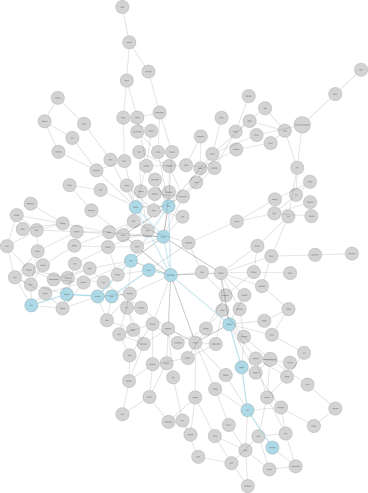

# Deutschlandreise

This repo contains a script to calculate the shortest path between two or  
more cities in the topology used by the German board game Deutschlandreise.  

  
&nbsp;  


## Contents
* [Install](#install)
* [Game Rules](#game-rules)
* [Additional & Ignored Rules](#additional-ignored-rules)
* [Basic Usage](#basic-usage)
* [Topology Data](#topology-data)
* [Discrepancies](#discrepancies)
* [Images](#images)  
&nbsp;  


### Install

To use the script one must install the following prerequisites:  

Ubuntu:  
```bash
sudo -H pip3 install networkx numpy matplotlib pydot
sudo apt-get install graphviz
```

Mac:  
```bash
sudo -H pip3 install networkx numpy matplotlib pydot
brew install graphviz
```

Other:
```bash
echo "make a PR"
```
&nbsp;  


### Game Rules

Deutschlandreise is a board game which requires players to navigate their way  
between cities in Germany and neighbouring countries. Each player has a  
unique list of cities they must visit before returning to their "home" city  
(the one they started at). The aim of the game is to be the first player to  
visit all required cities and return to your home city. The biggest  
contributing factor towards winning the game is ensuring the shortest path  
is taken around the board, which is why this script was written.  

Below is a picture of one side of the board (it has the same topology on  
both sides however, they have different designs).  

  
&nbsp;  


### Additional & Ignored Rules

The English translation of [the rules](Images/Rules) have been photographed  
for reference.  

There are some additional rules to consider when playing the board game that  
are not considered by the script:  

* Some of the cities on the board are numbered e.g., the number 27 is written on the [Bayreuth card](Images/Cards/Bayreuth.jpg) and next to Beyreuth on [the board](Images/Box and Board/IMG_20181231_151305.jpg)). These numbered city cards often have an instruction on them which could be to miss a turn or move to a specific city.

* Rolling the number one [three times on a dice entitles the player to a Chance card](Images/Rules/IMG_20181231_152146.jpg). It is not clear in the rules if this is only when a player rolls the number one on three successive turns or at any point during the game.

* [2 players can't be visiting the same city at the same time](Images/Rules/IMG_20181231_151808.jpg), which means that a player can block other players on their journey, altering their shortest path topology.

* Despite not being explained in the English version [the rules suggest](Images/Rules/IMG_20181231_152118.jpg) that players must role the correct number on the dice to visit non-numbered city on their journey. However, assuming dice rolls are independent this shouldn't affect the shortest path topology the script produces.  
&nbsp;  


### Basic Usage

The script has two basic modes of operation. By default, "loose" mode is  
used. The user must specify a list of cities which need to be visited and the  
script will print the shortest route which connects them all. In loose mode  
the route produced by the script will connect all the cities the user listed  
but, not necessarily in the order specified. The second basic mode of  
operation is "strict" mode. In this mode the script will print the shortest  
route which connects all cities the user specifies ensuring the order entered  
is maintained.  

Below is output from the script when run in the default loose mode.  
The order in which the required cities are specified on the CLI is already  
the shortest possible route:

```bash
mbp:deutschlandreise jwbensley$ python3 ./shortest_path.py -j Essen,Berlin,Frankfurt/Main,Hannover,Hamburg,Ravensburg,Essen
Graph details:
Name: 
Type: Graph
Number of nodes: 168
Number of edges: 297
Average degree:   3.5357


Shortest loose journey: 20 connection(s)
From Essen to Berlin (4): ['Essen', 'Dortmund', 'Leverkusen', 'Köln', 'Berlin']
From Berlin to Frankfurt/Main (1): ['Berlin', 'Frankfurt/Main']
From Frankfurt/Main to Hannover (1): ['Frankfurt/Main', 'Hannover']
From Hannover to Hamburg (1): ['Hannover', 'Hamburg']
From Hamburg to Ravensburg (5): ['Hamburg', 'Frankfurt/Main', 'München', 'Augsburg', 'Ulm', 'Ravensburg']
From Ravensburg to Essen (8): ['Ravensburg', 'Ulm', 'Augsburg', 'München', 'Frankfurt/Main', 'Giessen', 'Siegen', 'Dortmund', 'Essen']
```

The above command produces the following topology diagram with the entire   
shortest path from Essen back to Essen highlighted. Topology diagrams are  
produced by default. The dotted lines are the flight connections.   
  
&nbsp;  


The output below shows the same set of cities (the same journey) requested in  
a different order. In the default loose mode, the script has provided a route  
which is in a different order than requested because it is shorter:  

```bash
mbp:deutschlandreise jwbensley$ python3 ./shortest_path.py -j Essen,Berlin,Ravensburg,Frankfurt/Main,Hannover,Hamburg,Essen
Graph details:
Name: 
Type: Graph
Number of nodes: 168
Number of edges: 297
Average degree:   3.5357


Shortest loose journey: 20 connection(s)
From Essen to Berlin (4): ['Essen', 'Dortmund', 'Leverkusen', 'Köln', 'Berlin']
From Berlin to Frankfurt/Main (1): ['Berlin', 'Frankfurt/Main']
From Frankfurt/Main to Hannover (1): ['Frankfurt/Main', 'Hannover']
From Hannover to Hamburg (1): ['Hannover', 'Hamburg']
From Hamburg to Ravensburg (5): ['Hamburg', 'Frankfurt/Main', 'München', 'Augsburg', 'Ulm', 'Ravensburg']
From Ravensburg to Essen (8): ['Ravensburg', 'Ulm', 'Augsburg', 'München', 'Frankfurt/Main', 'Giessen', 'Siegen', 'Dortmund', 'Essen']
```
&nbsp;


Finally, the below output shows the same cities being requested in strict  
mode. The cities are specified in a different order than above and due to the  
use of strict mode it can be seen that the total journey length (number of  
connections) is longer (21 instead of 20):  

```bash
mbp:deutschlandreise jwbensley$ ./shortest_path.py -s -j Essen,Ravensburg,Berlin,Frankfurt/Main,Hannover,Hamburg,Essen
Graph details:
Name: 
Type: Graph
Number of nodes: 168
Number of edges: 297
Average degree:   3.5357


Shortest strict journey: 21 connection(s)
From Essen to Ravensburg (8): ['Essen', 'Dortmund', 'Siegen', 'Giessen', 'Frankfurt/Main', 'München', 'Augsburg', 'Ulm', 'Ravensburg']
From Ravensburg to Berlin (5): ['Ravensburg', 'Ulm', 'Augsburg', 'München', 'Frankfurt/Main', 'Berlin']
From Berlin to Frankfurt/Main (1): ['Berlin', 'Frankfurt/Main']
From Frankfurt/Main to Hannover (1): ['Frankfurt/Main', 'Hannover']
From Hannover to Hamburg (1): ['Hannover', 'Hamburg']
From Hamburg to Essen (5): ['Hamburg', 'Bremen', 'Osnabrück', 'Münster', 'Wesel', 'Essen']
```
&nbsp;  


### Topology Data

The topology data for the Deutschlandreise board is stored in the  
[topology.json](topology.json) file. In total there are:  
168 cities, 278 direct (non-flight) connections and 20 flight connections.  

Within the JSON topology file the cities are listed under the `nodes[]` list  
based on the colour of the card they were written on: orange, green or red.  
Within the colour groups the cards are arranged based on their X and Y  
coordinates from `A` to `F` and `1` to `8`. Within the data for each city the  
X and Y coordinates as they are written on the city cards however, they are  
not used by the script in this repo. The coordinates are recorded in case  
they are required in the future. On the board the X axis reference `A` is the  
left-hand side and `F` is the right-hand side however, on the Y axis `1` is  
at the top and `8` is at the bottom. As the axis coordinates 'increase' (from  
`A` to `F` and from `1` to `8`) one moves from the top left to the bottom  
right.  

Within the JSON file cities from the same card group, e.g. orange, in the  
same X coordinate, e.g. `A`, are then arranged by Y coordinate moving  
southwards e.g., Metz is north of Nancy meaning Metz is listed above Nancy in  
the file. This was to help me find the cities in the file when looking at the  
physical board.  
&nbsp;  


### Discrepancies

The following is a list of discrepancies found whilst recording all the game  
data (i.e. what was written on the city cards, the inter-city links, the  
rules etc.):

* There are some discrepancies between what is written on the city cards and the board. 'Frankfurt am Main' is written on the city card but 'Frankfurt/Main' on the board. 'Frankfurt an der Order' is written as 'Frankfurt/Order' on both the city card and board. In this project both Frankfurt's are standardised to 'Frankfurt/'.
 
*  Not every black line (non-flight connection) on the board is listed in the topology JSON `links[]` list, some have been left out of the links data. One example is the two links between Kaiserlautern and Koblenz, topologically they are directly connected neighbours with two paths between each other. Only one link can be traversed at a time which is why only one link is listed between these two example cities, it has no impact on the game. Well, that is not entirely true; it has no impact on this script. The rules state that a player can't continuously "loop" between two neighbouring cities. This is presumably because the rules imply (although it's not clear) that a player must role the exact number on the dice to land on their desired city. Preventing players from "looping" between two neighbouring cities prevents players "wasting" moves if they roll a higher number than they need. It could be argued that with two connections between neighbouring cities the player is taking are different routes and they could "loop" between two cities without going back on themselves.

* The Stuttgart card lists its location as 'C 7/8' but on the board it's 'C 6/5'. It is assumed that this card contains a typo.

* There is a direct link between Bremen and Hannover and there is a flight connection between these two cities. For this reason, the script reports there being 1 less edge in the total for the graph because, the graph only supports a single edge between nodes.

* The [Bayreuth card](Images/Cards/Bayreuth.jpg) states in German and French that the player must miss 1 turn but, the English translation states 2 turns must be missed.
&nbsp;


### Images

The [Images](Images/) directory contains all the rules in English. an example  
City card, an example flight card, both sides of the board and the box. These  
were taken whilst visiting family with only a smartphone to hand as this  
wasn't planned.  
